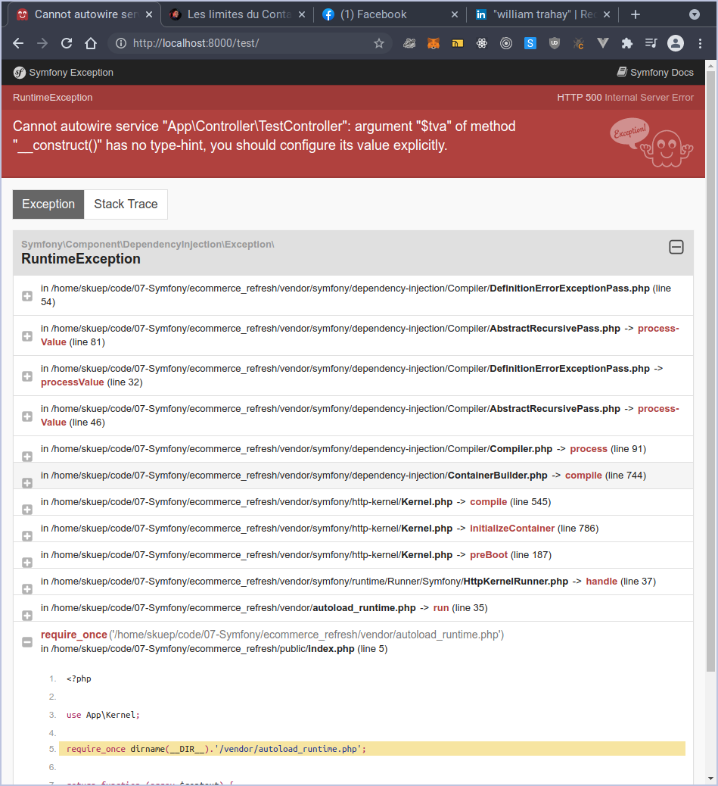

# Automatic Service Loading in services.yaml (SomethingInterface)

```php
<?php

namespace App\Controller;

use App\Services\Taxes\Calculator;
use Symfony\Bundle\FrameworkBundle\Controller\AbstractController;
use Symfony\Component\HttpFoundation\Request;
use Symfony\Component\HttpFoundation\Response;
use Symfony\Component\Routing\Annotation\Route;

class TestController extends AbstractController
{
    protected $calculator;
    protected $tva;

    public function __construct(Calculator $calculator,  $tva)
    {
        $this->calculator = $calculator;
        $this->tva = $tva;
    }


    #[Route('/test/', name: 'test',)]
    public function index(): Response
    {

        dd($this->calculator->calcul(120));
        return $this->render('test/index.html.twig', [
            'controller_name' => 'TestController',
        ]);
    }
}
```

\$tva won't be recognized



```yaml
# config/services.yaml
App\Services\Taxes\Calculator:
  arguments:
    $tva: 20
```

```php
<?php

namespace App\Controller;

use App\Services\Taxes\Calculator;
use Symfony\Bundle\FrameworkBundle\Controller\AbstractController;
use Symfony\Component\HttpFoundation\Response;
use Symfony\Component\Routing\Annotation\Route;

class TestController extends AbstractController
{
    protected $calculator;

    public function __construct(Calculator $calculator)
    {
        $this->calculator = $calculator;
    }


    #[Route('/test/', name: 'test',)]
    public function index(): Response
    {

        dd($this->calculator->calcul(120));
        return $this->render('test/index.html.twig', [
            'controller_name' => 'TestController',
        ]);
    }
}

```
